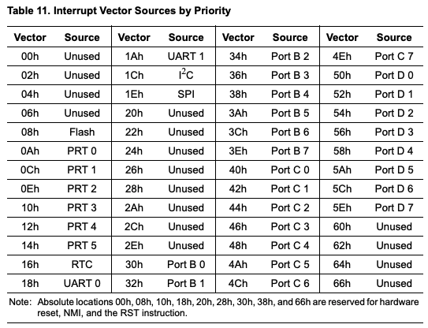
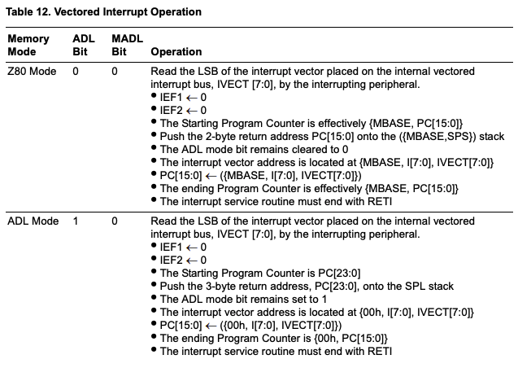
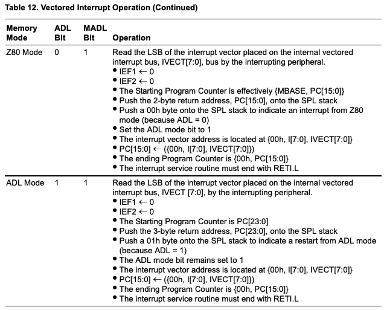

# Notes on Agon-Light Hardware

## EZ80 CPU

### Hardware Details

CPU:

- eZ80F92

Master clock:

- System clock speed for CPU: 18,432,000Hz

- Clock divisor: 16
  
  - Not sure what this is used for

Serial Interfaces:

- UART0: connects to ESP32 VDP
  
  - Runs at 1,152,000 baud (if fails drops back to 384,000 baud)

- UART1: 
  
  - Not sure what this is used for

Timers (x6):

- timer0: 

- timer1-5

Watch-Dog Timer

GPIO Ports

- Port B (bits 0-7)

- Port C (bits 0-7)

- Port D (bits 0-7)

SPI (Serial Peripheral Interface)

I2C Bus

RTC:

- There is no clock signal connected to the EZ80 RTC, so does not function

Interrupts:

- VBLANK: timer interrupt ever 20ms (i.e. 50Hz)
  
  - PORTB1_IVECT (0x32)
    
    - GPIO pin B1 coming from VDP

- UART0: handler for serial comms to the VDP
  
  - UART0_IVECT (0x18)

- UART1: not set up by MOS
  
  - UART1_IVECT (0x1A)

Flash memory:

- 128kbytes
  
  - 128 pages with 8 rows per page and 128 bytes per row
    
    - Can be protected in blocks of 16KB

- In addition to main Flash memory, there are two separately-addressable rows which comprise a 256-byte Information Page.

### Software Development

In ZDS Acclaim:

- `<ez80.h>`: includes `<eZ80F92.h>` based on `_EZ90F92` being defined
  
  - `#defines` for the internal hardware, including the interrupt vectors

### Interrupts

On the eZ80F92 device, all maskable interrupts use the CPU’s vectored interrupt function.
Table 11 lists the low-byte vector for each of the maskable interrupt sources. The
maskable interrupt sources are listed in order of priority, with vector 00h being the highest-priority interrupt. The full 16-bit interrupt vector is located at starting address {I[7:0],
IVECT[7:0]} where I[7:0] is the CPU’s Interrupt Page Address Register.



Your program must store the starting address of the interrupt service routine (ISR) in the
two-byte interrupt vector locations. For example, for ADL mode the two-byte address for
the SPI interrupt service routine would be stored at {00h, I[7:0], 1Eh} and {00h, I[7:0],
1Fh}. In Z80 mode, the two-byte address for the SPI interrupt service routine would be stored at {MBASE[7:0], I[7:0], 1Eh} and {MBASE, I[7:0], 1Fh}. The least-significant
byte is stored at the lower address.

When any one or more of the interrupt requests (IRQs) become active, an interrupt request
is generated by the interrupt controller and sent to the CPU. The corresponding 8-bit interrupt vector for the highest-priority interrupt is placed on the 8-bit interrupt vector bus,
IVECT[7:0]. The interrupt vector bus is internal to the eZ80F92 device and is therefore
not visible externally.

The response time of the CPU to an interrupt request is a function of the current instruction being executed as well as the number of wait states being asserted. The interrupt vector, {I[7:0], IVECT[7:0]}, is visible on the address bus, ADDR[15:0], when the interrupt
service routine begins. The response of the CPU to a vectored interrupt on the eZ80F92
device is explained in Table 12. Interrupt sources are required to be active until the interrupt service routine starts. It is recommended that the Interrupt Page Address Register (I)
value be changed by the user from its default value of 00h as this address can create conflicts between the nonmaskable interrupt vector, the RST instruction addresses, and the
maskable interrupt vectors.





#### MOS & Interrupts

Sets up interrupt vector table for the first 30h interrupts (i.e. does not include GPIO).

- This doesn't seem to equate with GPIO B1 being used for VSYNC

Two levels of tables are defined for the interrupt vectors:

- Interrupt Vector Table
  
  - this segment must be aligned on a 256 byte boundary anywhere below
  
  - the 64K byte boundary
  
  - each 2-byte entry is a 2-byte vector address

- 1st interrupt vector jump table.
  
  - This table must reside in the first 64K bytes of memory.
  
  - Each 4-byte entry is a jump to the 2nd jump table plus offset

- 2nd interrupt vector Jump Table. 
  
  - This table resides in RAM anywhere in the 16M byte range. 
  
  - Each 4-byte entry is a jump to an interrupt handler
    
    - Contains: `JP addr24` instructions for each interrupt
      
      - Set by default to `JP __default_mi_handler`
    
    - Default interrupt handler is just `EI; RETI.L`

#### VDP / Keyboard Interrupts

UART0 interrupt:

```
; AGON UART0 Interrupt Handler
;
_uart0_handler:       DI
            PUSH      AF
            PUSH      BC
            PUSH      DE
            PUSH      HL
            CALL      UART0_serial_RX        
            LD        C, A        
            LD        HL, _vdp_protocol_data
            CALL      vdp_protocol
            POP       HL
            POP       DE
            POP       BC
            POP       AF
            EI
            RETI.L    
```

`UART0_serial_RX`: gets a single byte from UART0 in A 

- If there is no data returns with carry clear

- If data, returns byte in A with carry set

In the above code, it always assumes that there will be data because it is triggered by the UART0 interrupt.

Calls `vdp_protocol` with the address of the buffer if HL and the character in C

```
; The UART protocol handler state machine
;
vdp_protocol:
            LD    A, (_vdp_protocol_state)
            OR    A
            JR    Z, vdp_protocol_state0
            DEC   A
            JR    Z, vdp_protocol_state1
            DEC   A
            JR    Z, vdp_protocol_state2
            XOR   A
            LD    (_vdp_protocol_state), A
            RET
```

Maintains a state machine to reflect the state of the VDP protocol:

- State 0: waiting for control byte / command
  
  - Control bytes have bit-7 set

- State 1: get the packet length

- State 2: read the packet body

**State 0:**

```
; Wait for control byte (>=80h)
;
vdp_protocol_state0:
            LD    A, C            ; Wait for a header byte (bit 7 set)
            SUB   80h
            RET   C
            CP    vdp_protocol_vesize     ; Check whether the command is in bounds
            RET   NC                      ; Out of bounds, so just ignore
            LD    (_vdp_protocol_cmd), A  ; Store the cmd (discard the top bit)
            LD    (_vdp_protocol_ptr), HL ; Store the buffer pointer
            LD    A, 1                    ; Switch to next state
            LD    (_vdp_protocol_state), A
            RET
```

Receives control byte from UART0 then:

- Return if not a control / command byte

- Store the command (with bit-7 cleared)

- Reset the incoming data point - the address is passed in from `_uart0_handler`

- Transition to state 1

**State 1:**

```
; Read the packet length in
;
vdp_protocol_state1:
            LD    A, C                ; Fetch the length byte
            CP    VDPP_BUFFERLEN + 1  ; Check if it exceeds buffer length (16)
            JR    C, $F               ;
            XOR   A                   ; If it does exceed buffer length, reset state machine
            LD    (_vdp_protocol_state), A
            RET
;
$$:         LD    (_vdp_protocol_len), A   ; Store the length
            OR    A                        ; If it is zero
            JR    Z, vdp_protocol_exec     ; Then we can skip fetching bytes, otherwise
            LD    A, 2                     ; Switch to next state
            LD    (_vdp_protocol_state), A
            RET
```

Receives packet length byte from UART0 then:

- Checks does not exceed buffer length - if it does, it resets the state machine

- Store the length of the packet

- If zero, executes the packet immediately (`vdp_protocol_exec`)

- Transition to state 2

**State 2:**

```
; Read the packet body in
;
vdp_protocol_state2:
            LD    HL, (_vdp_protocol_ptr)   ; Get the buffer pointer
            LD    (HL), C                   ; Store the byte in it
            INC   HL                        ; Increment the buffer pointer
            LD    (_vdp_protocol_ptr), HL
            LD    A, (_vdp_protocol_len)    ; Decrement the length
            DEC   A
            LD    (_vdp_protocol_len), A
            RET   NZ                        ; Stay in this state if there are still bytes to read


```

Receives data bytes from UART0 then:

- Stores byte in buffer and increments the pointer

- Decrease the remaining length

- Returns if there are still bytes to collect

- Otherwise continues / falls through to `vdp_protocol_exec`

**Command Execute:**

```
; When len is 0, we can action the packet
;

vdp_protocol_exec:
            XOR   A                        ; Reset the state
            LD    (_vdp_protocol_state), A    
            LD    DE, vdp_protocol_vector
            LD    HL, 0                    ; Index into the jump table
            LD    A, (_vdp_protocol_cmd)   ; Get the command byte...
            LD    L, A                     ; ...in HLU
            ADD   HL, HL                   ; Multiply by four, as each entry is 4 bytes
            ADD   HL, HL                   ; And add the address of the vector table
            ADD   HL, DE
            JP    (HL)                     ; And jump to the entry in the jump table

```

Execute the command with the complete received packet of data

- Reset the state machine to zero for next incoming data

- Jump to the command using the command vector, indexed by the saved command


Incoming protocol / data information is maintained in:

- `_vdp_protocol_cmd`: incoming command - with bit-7 cleared

- `_vdp_protocol_state`: position in state machine

- `_vdp_protocol_len`:  length of data associated with this command (sent by VDP)

- `_vdp_protocol_ptr`: position to store next incoming byte


Format of VDP protocol data:

- Command (1 byte)
  
  - GP
  
  - KEY
  
  - CURSOR
  
  - SCRCHAR
  
  - POINT
  
  - AUDIO
  
  - MODE
  
  - RTC
  
  - KEYSTATE

- Length (1 byte)

- Data (n bytes) - length depends upon the command

##### KEY Command

Data packet sent from VDP (4 bytes):

- `keycode`: contains the ASCII key code

- `modifiers`: contains the modifiers packed into a single byte

- `item.vk`: represents each possible real or derived (shift+real) key

- `item.down`:

```
; Keyboard Data
; Received after a keypress event in the VPD
;
vdp_protocol_KEY:
            LD        A, (_vdp_protocol_data + 0)    ; ASCII key code
            LD        (_keyascii), A
            LD        A, (_vdp_protocol_data + 1)    ; Key modifiers (SHIFT, ALT, etc)
            LD        (_keymods), A
            LD        A, (_vdp_protocol_data + 3)    ; Key down? (1=down, 0=up)
            LD        (_keydown), A
            LD        A, (_keycount)                 ; Increment the key event counter
            INC       A
            LD        (_keycount), A
            LD        A, (_vdp_protocol_data + 2)    
            LD        (_keycode), A
;
; Now check for CTRL+ALT+DEL
;
            CP        130                ; Check for DEL (cursor keys)
            JR        Z, $F
            CP        131                ; Check for DEL (no numlock)
            JR        Z, $F
            CP        88                 ; And DEL (numlock)
            RET       NZ
$$:         LD        A, (_keymods)      ; DEL is pressed, so check CTRL + ALT
            AND       05h                ; Bit 0 and 2
            CP        05h
            RET       NZ                 ; Exit if not pressed
;
; Here we're just waiting for the key to go up
;
            LD        A, (_keydown)      ; Get key down
            DEC       A                  ; Check for 0
            JP        NZ, 0                
            LD        (_keyascii), A     ; Otherwise clear the keycode so no interaction with console 
            LD        (_keycode), A 
            RET
```

Based on the received KEY VDP protocol packet:

- Store ASCII code, modifiers and  key down status in MOS SYSVARs

- Increments the `sysvar_vkeycount` – this is incremented every time a key packet is received

- Check for Ctrl-Alt-Del pressed

- If Ctrl-Alt-Del pressed, wait for keys to be released


The VDP protocol data comes from FabGL `kb->getNextVirtualKey(&item, 0)`

Where item is an instance of `fabgl::VirtualKeyItem item;` with public attributes

Public Attributes

- uint8_t     CAPSLOCK: 1

- uint8_t     CTRL: 1

- uint8_t     down

- uint8_t     GUI: 1

- uint8_t     LALT: 1

- uint8_t     NUMLOCK: 1

- uint8_t     RALT: 1

- uint8_t     scancode [8]

- uint8_t     SCROLLLOCK: 1

- uint8_t     SHIFT: 1

- VirtualKey     vk

[VirtualKey]([FabGL: fabgl::VirtualKey](http://www.fabglib.org/group___enumerations_gad0e6e31d5953384be4ea987eb3923e02.html#gad0e6e31d5953384be4ea987eb3923e02)) represents each possible real or derived (shift+real) key

Note that keyboard de-bouncing is done by the VDP.
